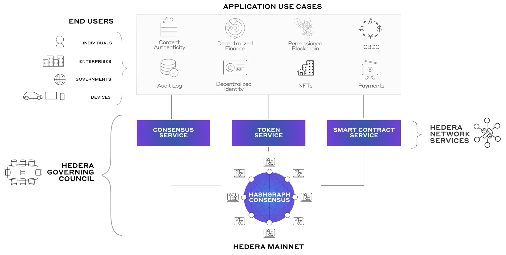
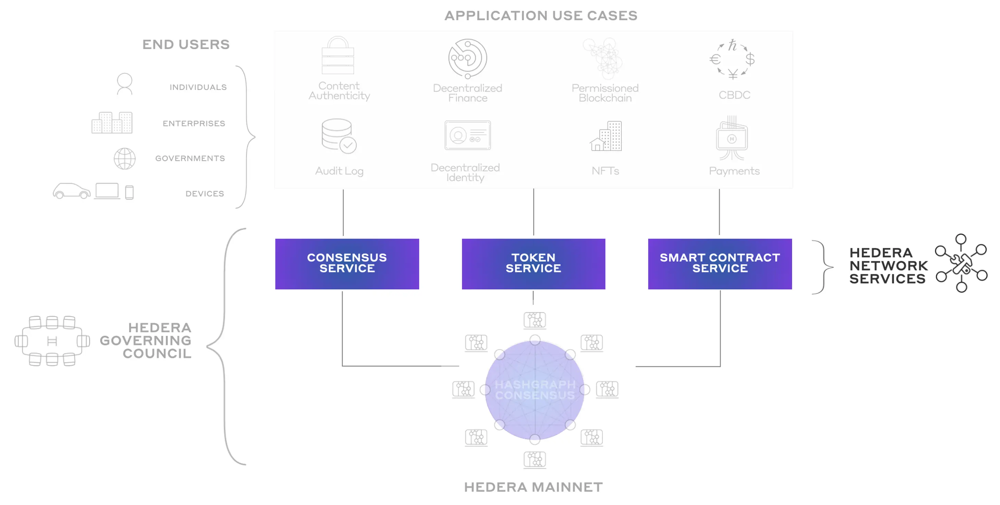

# Exploring Hedera

Welcome to this Hedera High Level Wrapper package.

I've encapsulated a couple of functions within this repository.

This tutorial is split in two sections.

`Section one` incorporates some theoretical knowledge.

`Section two` incorporates a technical and programmatical approach to the Hedera network


## Install & Prepare

Install dependencies to ensure examples are executable

`yarn`


Create yourself an account

`yarn create-account`

or create it here and get your testnet funds: 

[Hedera Account](https://portal.hedera.com/dashboard)

## Section one: Things to know

#### What is Hedera?



### Hedera's Consensus

The Hedera public network is `proof-of-stake` and built on the `open source hashgraph distributed consensus algorithm`,
invented by Dr. Leemon Baird, Hedera Co-founder and Chief Scientist. The hashgraph consensus algorithm provides
near-perfect efficiency in bandwidth usage and consequently can process hundreds of thousands of transactions per second
in a single shard (a fully connected, peer-to-peer mesh of nodes in a network).

Unlike a traditional proof-of-work blockchain, which selects a single miner to choose the next block, the community of
nodes running hashgraph come to an agreement on which transactions to add to the ledger as a collective. Through
gossip-about-gossip and virtual voting, the hashgraph network comes to consensus on both the validity and the consensus
timestamp of every transaction. If the transaction is valid and within the appropriate time, the ledger’s state will be
updated to include the transaction with 100% certainty (finality).

In blockchain, consensus rules require that blocks eventually settle in a single, longest chain, agreed upon by the
community. If two blocks are created at the same time, the network nodes will eventually choose one chain to continue
and discard the other one, lest the blockchain “fork” into two different chains. It is like a growing tree that is
constantly having all but one of its branches chopped off.

### Hederas Application Use Cases

Hedera offers 3 major application uses cases.

1. Consensus Service
2. Token Service
3. Smart Contract Service

All of them can be coded with Typescript



### 1. Consensus Service

The Hedera Consensus Service offers applications direct access to the native speed, security, and fair ordering
guarantees of the hashgraph consensus algorithm. Using this service, clients can submit messages to the Hedera public
ledger for time-stamping and ordering. Clients can also encrypt the message contents, ensuring an application's ability
to preserve their user's privacy and prevent the publishing of PII.

Messages can include important actionable information in them, events such as for a money transfer settlement, user
engagements in an advertising platform, tracking of provenance in a supply chain, and more. These ordered messages will
flow out to mirror nodes or clients of mirror nodes for processing in the consensus order. By using Hedera for
tamper-proof and verifiable logging of transactions, disparate participants and systems have a real-time view into
application events.

Create a topic

```javascript
    // Create a new topic
const transactionId = new ConsensusTopicCreateTransaction().execute(client);

// Grab the newly generated topic ID
const topicId = transactionId.getReceipt(client).getConsensusTopicId();
```

Create your first message

```javascript
    // Submit a message to a topic
const response = new ConsensusMessageSubmitTransaction()
    .setTopicId(topicId)
    .setMessage("Hellooooooo")
    .execute(client)
    .getReceipt(client);
```

### 2. Token Service

The native Hedera Token Service offers applications the ability to perform configuration, minting, and management of
fungible and non-fungible tokens on Hedera. Tokens on Hedera achieve `10,000 transactions per second`, settle with
finality immediately, and always cost `$0.0001 USD`, paid in `HBAR`, to transfer.

Developers have fine-grained control over
tokens and accounts on Hedera, with key and token configurations that deliver flexibility for account KYC verification
and freeze, token supply management, transfer, and more. For full layer 1 programmability, you can integrate any type of
token minted using Hedera Token Service directly into your Solidity smart contract.

`Examples are shown in section 2`

### 3. Smart Contracts on Hedera

The Hedera Smart Contract service lets you program in Solidity and utilizes the Besu Ethereum Virtual Machine (EVM). The
Besu EVM has been specifically optimized for the Hedera network and hashgraph consensus, allowing for hundreds of
transactions per second, low and predictable fees, a carbon-negative footprint, and incredible performance at 15 million
gas per second.

You can write the contract in Solidity, deploy it and access it through the `Hedera SDK` with Typescript (e.g.)

`Examples are shown in section 2`

## Section Two: Let's get practical

Each example is presented with a specific testcase. Hence, you can run the example yourself and play around.

` ⚠ Watch out for ACT comments`

Each test contains an `ACT` comment.

This is the part where I abstracted things away to get a more readable test case.

Hence, by analyzing the method marked with `ACT` you can see the necessary steps you need to undergo to implement this
on your end.

-------

#### Create a client

Create your Hedera Testnet Client to interact with Hedera

```typescript
const clientConfiguration: ClientConfiguration = {
    accountId: TEST_ACCOUNT_ID,
    accountPrivateKey: TEST_MY_PRIVATE_KEY,
    network: "testnet",
    options: {
        defaultMaxTransactionFee: 50,
        defaultMaxQueryPayment: 50,
    },
};

/** @ACT: Get new client */
const client = createClient(clientConfiguration);
```

-------

#### Create an account

Create an Hedera Testnet Account

```typescript
const client = createClient({
    accountId: TEST_ACCOUNT_ID,
    accountPrivateKey: TEST_MY_PRIVATE_KEY,
    network: "testnet",
});

/** @ACT: Create new Account */
const {
    accountId,
    accountCreationReceipt
} = await createAccount({client});
```

-------

#### Create an transfer

Transfer HBar from A to B

```typescript
const client = createClient({
    accountId: TEST_ACCOUNT_ID,
    accountPrivateKey: TEST_MY_PRIVATE_KEY,
    network: "testnet",
});

/** @ACT: Create new account */
const {accountId: receiverAccountId} = await createAccount({client});

/** @ACT: Transfer HBar */
const txResult = await transfer(
    client,
    AccountId.fromString(TEST_ACCOUNT_ID),
    receiverAccountId,
    1,
);
```

-------

#### Create a token

Create yourself a token, either `fungle` or `non-fungible`.

```typescript
const tokenConfig: TokenConfig = {
    account: {
        id: TEST_ACCOUNT_ID,
        privateKey: TEST_MY_PRIVATE_KEY
    },
    initialTokenSupply: 1_000_000,
    tokenDecimals: "10",
    tokenName: "Fungible Token",
    tokenSymbol: "FUNGI",
    type: TokenType.FungibleCommon
}

    /** @ACT: Create new token */
    const token = await createToken(tokenConfig);
});```